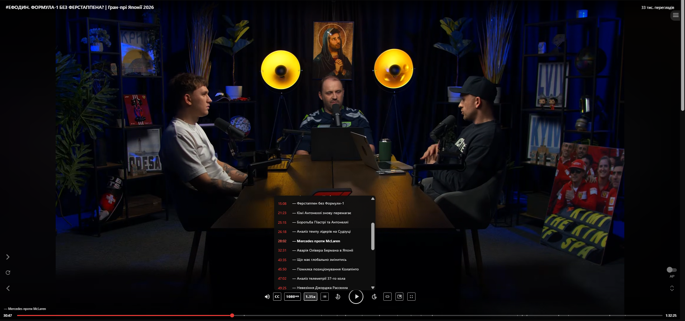

# YouTube Custom Player Skin — Chrome Extension

A Chrome extension that replaces the default YouTube player controls with a custom cinematic skin.

## Features

### Main Player
- **Top overlay bar** — video title, channel name, and view count
- **Centered transport controls** — play/pause, volume slider, skip ±10 s, chapter prev/next
- **Bottom bar** — seek bar with buffer fill, draggable thumb, chapter markers, storyboard hover previews, and scrub tooltip
- **Closed Captions** — toggle and select subtitle track via inline menu
- **Quality selector** — switch between Auto, 4K, 1440p, 1080p, 720p, etc.
- **Playback speed** — presets (1×, 1.25×, 1.35×, 1.5×, 1.75×, 2×, 2.5×, 3×) plus a custom numeric input
- **Chapter list** — floating panel with pin/drag support; seek bar chapter markers; auto-scroll highlight
- **Live stream support** — hides skip/chapter controls; LIVE button turns red at live edge, grey when seeked back; uses YouTube's `isAtLiveHead()` API for accurate detection
- **Theater mode & Fullscreen** — buttons with state sync against YouTube's native player
- **Picture-in-Picture** — Document PiP with full custom skin (play, volume, seek, CC, quality, speed, chapters, live button)
- **Media Session API** — integrates with OS media controls (Windows, macOS, etc.)
- **Toggle on/off** — via the extension popup, no page reload needed

### Security
- Unique per-session nonce for bridge `postMessage` communication, preventing rogue scripts from sending commands to the bridge

## Installation (Development)

1. Clone or download this repository.
2. Open **Chrome** → navigate to `chrome://extensions`.
3. Enable **Developer mode** (toggle in the top-right corner).
4. Click **Load unpacked** and select the `YouTube-Useful-Skin` folder.
5. Navigate to any YouTube video — the custom skin is applied automatically.

> **After updating the extension**, click the reload (↺) button on `chrome://extensions` and refresh the YouTube tab to clear the module cache.

## Screenshot



## File Structure

```
YouTube-Useful-Skin/
├── manifest.json               # Extension manifest (Manifest V3)
├── generate-icons.js           # Script to generate PNG icons from SVG
├── content/
│   ├── skin.css                # Main visual styles for the custom skin
│   ├── skin.js                 # Content script entry point — imports modules, wires player
│   ├── bridge.js               # Page-context bridge (main world), nonce-authenticated
│   ├── pip.css                 # Picture-in-Picture specific styles
│   ├── bridge/                 # Page-context handlers (have access to YouTube's player API)
│   │   ├── captions.js         # Closed captions control
│   │   ├── chapters.js         # Chapter metadata extraction
│   │   ├── fullscreen.js       # Fullscreen toggle & sync
│   │   ├── quality.js          # Quality selection
│   │   ├── storyboard.js       # Storyboard preview URL fetch
│   │   ├── syncState.js        # Player state sync (quality, captions, isAtLiveHead)
│   │   └── volume.js           # Volume persistence via YouTube API
│   └── skin/                   # UI components (isolated world)
│       ├── buildSkin.js        # DOM construction for the overlay
│       ├── constants.js        # Quality labels, speed options, timing constants
│       ├── icons.js            # SVG icon definitions
│       ├── mediaSession.js     # Media Session API integration
│       ├── pip.js              # Document Picture-in-Picture handler
│       ├── storyboard.js       # Storyboard spec parser & frame calculator
│       └── utils.js            # Helper functions (qs, ce, fmtTime)
├── popup/
│   ├── popup.html              # Extension popup UI (enable/disable toggle)
│   └── popup.js                # Popup logic — persists state via chrome.storage
└── icons/
    ├── icon16.png / icon16.svg
    ├── icon48.png / icon48.svg
    └── icon128.png / icon128.svg
```

## Architecture

The extension uses a **dual-context bridge architecture** to interact with YouTube's private player API.

### Content Script (Isolated World)
- **`skin.js`** — Entry point; imports all ES6 modules via dynamic `import()`, wires up the overlay
- **`skin/`** modules — Build UI, handle user interactions, render storyboards, manage PiP
- Communicates with the page context via `window.postMessage()` with a per-session nonce

### Page Context Bridge (Main World)
- **`bridge.js`** — Injected into the page's main world so it can call `movie_player` API methods
- **`bridge/`** handlers — Each feature is its own module; validates the nonce before responding
- Replies to the content script via `window.postMessage()`

### Live Stream Detection
The LIVE button colour is driven by **`ytP.isAtLiveHead()`** — YouTube's own internal API — polled via the bridge every 2 seconds. This is more reliable than estimating latency from `video.seekable` ranges, which vary with HLS/DASH buffer depth.

- Red = at live edge (or bridge hasn't replied yet — safe default)
- Grey = seeked back more than a couple of seconds behind the live edge

## License

MIT
